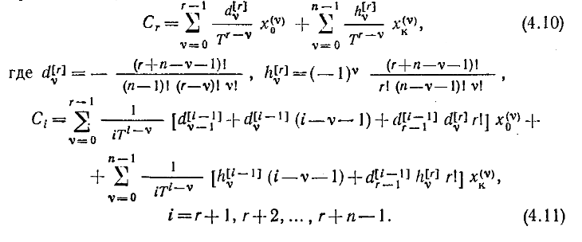
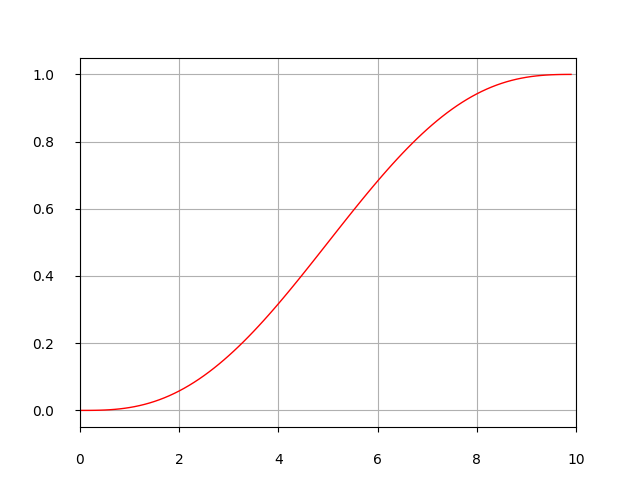
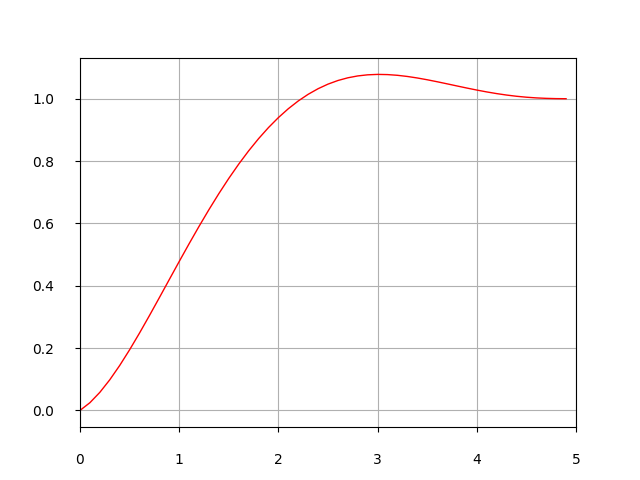

# Terminal-Function
This is a function that i made while lirning python. It makes adjustable polinomial curve coefficients of smooth thransition in predetermined time.
Basically this is implementation of the method described in the textbook "Batenko A.P. Sistemy terminalnogo upravleniya" on p.50.  
  
## Setup
The function requires 2 listlike inputs and 1 float input:  
x_initial : list (n,1) of initial state, 1 element is the coordinate of the end point and every next element is i's derivative of that coordinate.  
x_end : list (n,1) of end state, 1 element is the coordinate of the end point and every next element is i's derivative of that coordinate.  
T: termial time when curve reaches its end coordinate.  
It returns list (n^2,1) of polinomial coefficients where elemement i is the coefficient of the t^i term  
## Examples  
There is a example of function implementation in terminal_example.py file.  
the simpliest example is the x_initial = [0,0] and x_end = [1,0] ant T = 5, so no initial or final velosity is applied.  
  
And here is an example of initial accleration of 0.1 so x_initial = [0,0,0.1]  
  
